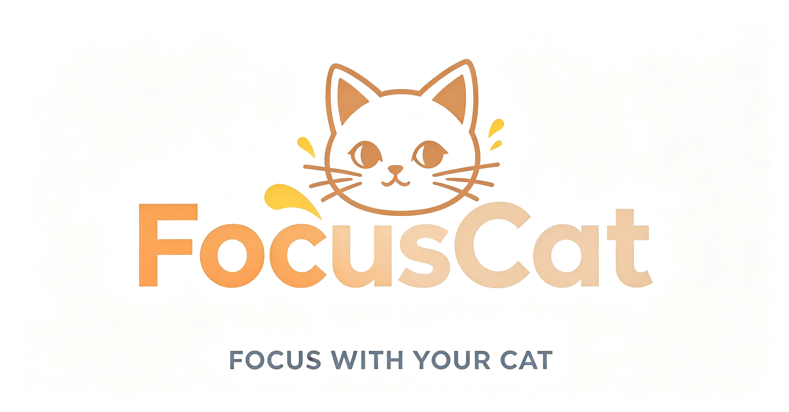
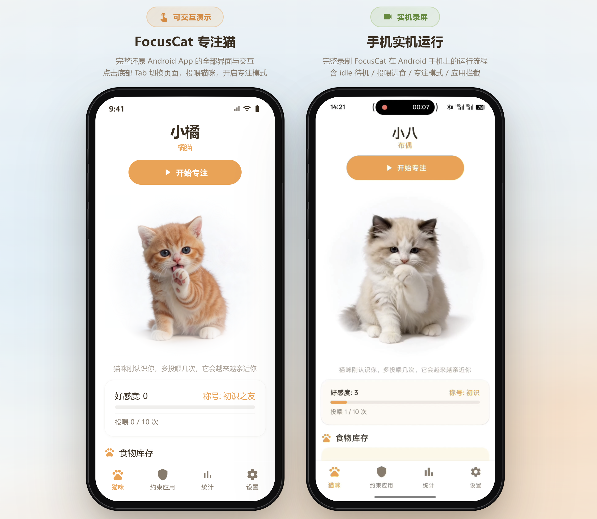
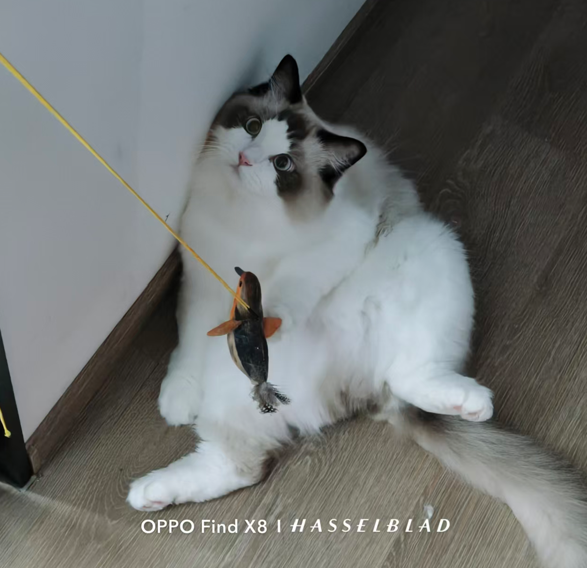

<h1 align="center">FocusCat · 专注猫</h1>

<p align="center">
  <strong>用反思问答挽回注意力，用猫咪养成留住专注习惯</strong>
</p>

<p align="center">
  <a href="https://github.com/LiuYihey/FocusCat/releases">下载 APK</a>
  ·
  <a href="https://focuscat.online/">在线 Web 演示</a>
  ·
  <a href="http://xhslink.com/o/9T6S2KikAru">小红书演示视频</a>
</p>

---

## 简介

想要专注时却「无意识」点开了娱乐 app？点进 app 看见满满的首页，就忘了自己到底要干嘛？

**FocusCat（专注猫）** 可以帮你：

- **自由选择约束应用** — 指定你想控制的娱乐 / 分心 app
- **进入前反思复盘** — 预设思考问题，在进入娱乐页面前先停下来想一想
- **猫咪正向激励** — 每次复盘完成并退出娱乐 app，就能为你的小猫攒一份猫粮，增加好感度
- **定时二次提醒** — 选择进入也没关系，固定时间点后小猫会再提醒你一次
- **锁机专注模式** — 完全专注时不能切屏，每专注半小时获得额外奖励

把「克制分心」从痛苦约束，变成温柔陪伴。

<p align="center">
  
</p>

---

## 功能亮点

| 功能 | 说明 |
|------|------|
| 应用拦截 | 打开被约束的 app 前弹出反思问答页 |
| 自定义问题 | 3 个开放式反思问题，可在设置中编辑 |
| 猫咪养成 | 选猫、投喂、好感度升级、成就解锁 |
| 专注锁机 | 专注时段禁止切屏，完成时段获得奖励 |
| 数据统计 | 记录拦截次数、专注时长等数据 |

---

## 下载安装

### 方式一：直接安装 APK（推荐）

从 [GitHub Releases](https://github.com/LiuYihey/FocusCat/releases) 下载最新版 `app-release.apk`，在 Android 手机上安装即可。

> 首次安装需在系统设置中允许「安装未知来源应用」。

### 方式二：自行编译

#### 环境要求

- Android Studio Hedgehog (2023.1.1) 或更高版本
- JDK 17
- Android SDK（compileSdk 35）
- Windows / macOS / Linux

#### 构建步骤

```bash
# 1. 克隆仓库
git clone git@github.com:LiuYihey/FocusCat.git
cd FocusCat

# 2. 配置本地 SDK 路径（Android Studio 通常会自动生成）
# 创建 local.properties，内容示例：
# sdk.dir=C\:\\Users\\YourName\\AppData\\Local\\Android\\Sdk

# 3. （可选）配置 release 签名
cp gradle.properties.example gradle.properties
# 编辑 gradle.properties，填入签名信息；或将属性写入 ~/.gradle/gradle.properties

# 4. 构建 Debug 版（无需签名，适合开发调试）
./gradlew assembleDebug
# Windows: gradlew.bat assembleDebug

# 5. 构建 Release 版（需配置签名密钥）
./gradlew assembleRelease
# 产物路径：app/build/outputs/apk/release/app-release.apk
```

#### 首次使用权限

安装后请按引导开启以下权限，否则拦截功能无法正常工作：

1. **无障碍服务** — 检测前台应用
2. **使用情况访问** — 统计应用使用数据
3. **悬浮窗** — 显示拦截页面
4. **通知**（Android 13+）— 前台服务保活
5. **电池优化白名单** — 避免系统杀死后台服务

---

## 技术栈

- **语言**：Kotlin
- **UI**：Jetpack Compose + Material 3
- **架构**：MVVM + Hilt 依赖注入
- **数据库**：Room
- **最低系统**：Android 8.0（API 26）
- **目标系统**：Android 15（API 35）

---

## 项目结构

```
FocusCat/
├── app/                    # 主应用模块
│   └── src/main/           # 源码、资源、Manifest
├── docs/                   # 设计文档
├── gradle/                 # Gradle Wrapper
├── logo.png                # 项目 Logo
├── build.gradle.kts        # 顶层构建配置
├── settings.gradle.kts     # 模块配置
├── gradle.properties.example  # 签名配置模板（不含密钥）
└── gradlew.bat             # Windows 构建脚本
```

---

## 致谢

感谢传奇布偶猫原型 — **小八 / little eight / little 八 / 小eight**

<p align="center">
  
</p>

<p align="center">
  <sub>Made with 🐱 by LiuYihey</sub>
</p>
